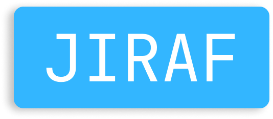

<p align="center">
    
    <br/>
    A basic project builder for Odin
    <br/>
    <br/>
</p>


# Jiraf - Odin Project Creation Tool

Jiraf is a minimal project creation tool for Odin. It creates a basic project structure to get started. It is currently in active development and in its infancy. Feel freee to read the [CONTRIBUTING](https://github.com/gweithio/jiraf/blob/main/CONTRIBUTING.md) if you wish to contribute to the project.

See [article on Jiraf](https://www.epmor.app/posts/introducing-jiraf) for some background information

## Usage

## Minimum Commands

`-name` and `-type` are *required* commands can be done in any order

```bash
$ jiraf -name:"ExampleProject" -type:exe 
```

See the `example/` for an example of what jiraf generates

## Full commands

```bash
$ jiraf -name:"Test Project" -author:"ethan@epmor.app" -desc:"My cool project" -version:"0.1" -type:exe 
```

## Warnings

* Jiraf is still in development.
